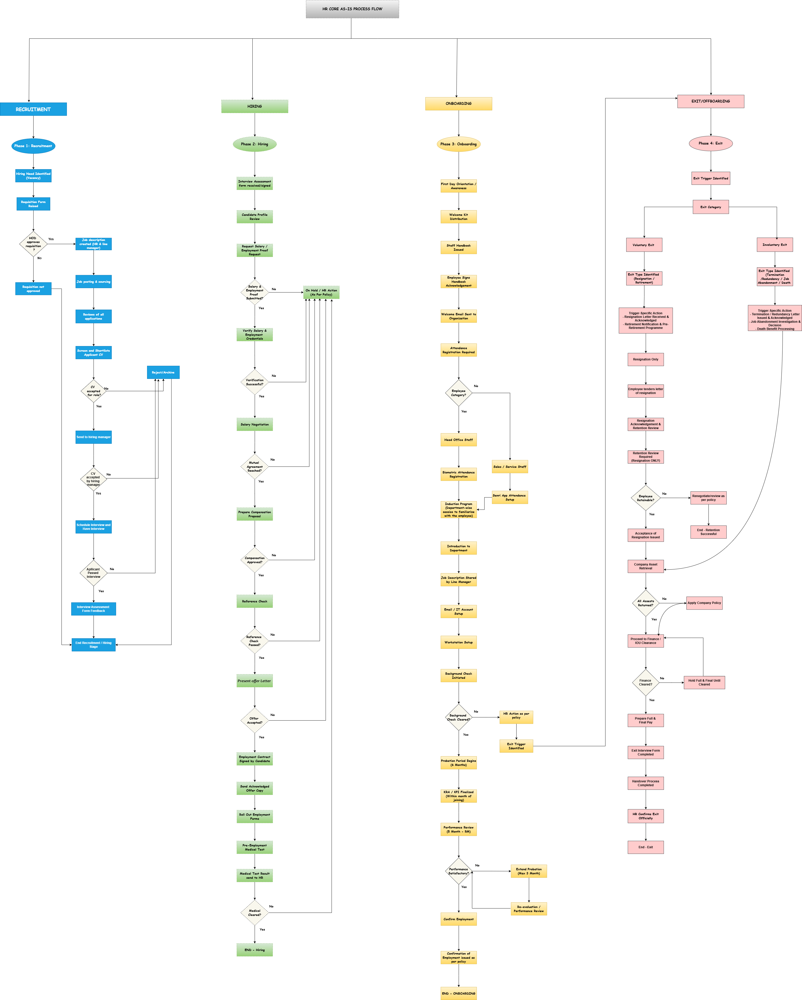

## Project Overview
This project maps the end-to-end HR lifecycle from recruitment to exit
It shows how activities are carried out, where key decisions happen, and how data flows across the process
The aim is to establish a clear view of the current state, highlight gaps, and support future improvements

## AS-IS Process Flow

## Scope
The work covers the full HR journey, including recruitment, hiring, onboarding, employee management, and exit processes
It captures approvals, decision points, handoffs between teams, and key data points across each stage
As part of this, critical data elements were identified to improve structure and consistency

## Business Impact
The outputs from this work supported the development of an internal HR portal by providing clarity on process flow and structured data requirements
